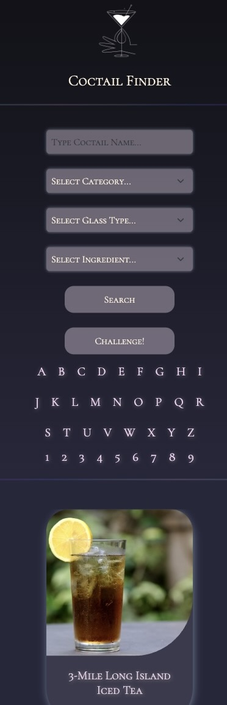
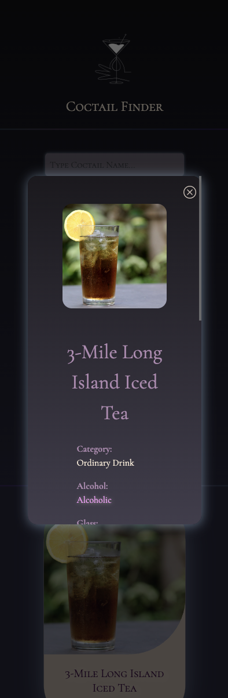

#  Cocktail receipe app

Responsive coctails application is developed using javascript and bootstrap to practice API. All API used from -  <a href="https://www.thecocktaildb.com/api.php" style="font-size:small;">TheCoctailDB</a>

Main tasks:
 • Filtering function: by name, type, glass, ingredients, first letter
 • Filter alcoholic/non-alcoholic drinks
 • "Challenge" button: random coctail receipe
 • Modal window
 • Local storage

<h4>🔹 Cocktail recipe app sample - <a href="https://simonakom.github.io/coctails-api/coctails.html" style="font-size:small;">View</a><h4>

### Desktop version:

  
    

### Mobile version:
  
    

